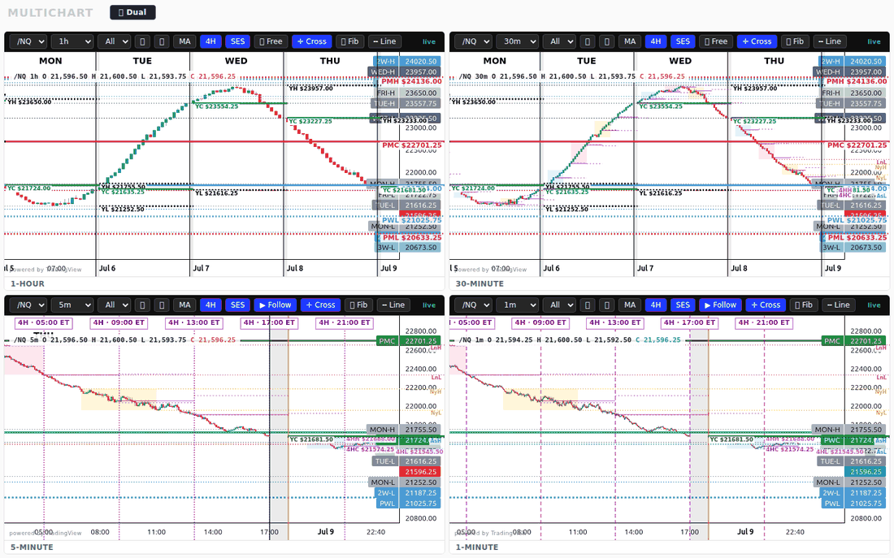
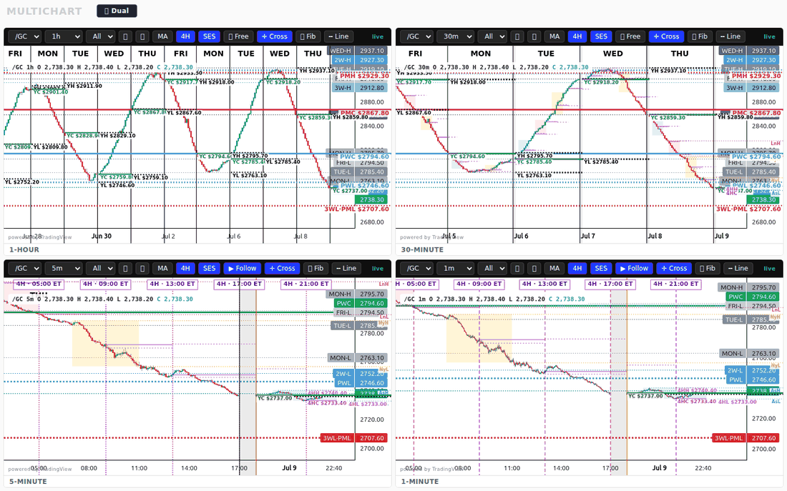
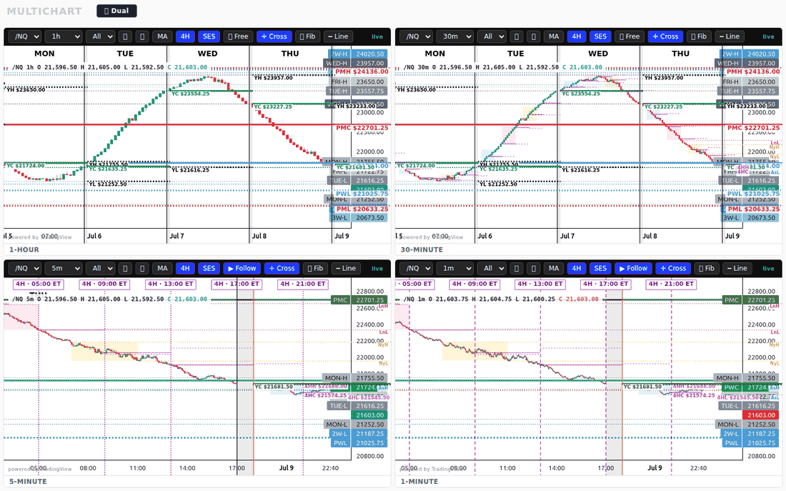
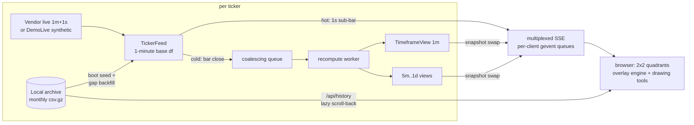

# realtime-market-charting

A realtime multi-quadrant futures charting platform, built from scratch: Flask + gevent
backend streaming live 1-minute bars into per-ticker feeds, per-timeframe views resampled
on demand, one multiplexed Server-Sent-Events stream per page, and a
TradingView-lightweight-charts frontend with a full overlay engine — session boxes,
prior-day/week/month levels, dividers, anchored VWAPs, moving averages, and a
cross-window drawing tool.

**Runs with zero market-data account:** `DEMO=1 ./run.sh` boots the entire stack on a
deterministic synthetic feed that honors the CME session calendar (daily maintenance
break, weekend closure) and streams synthetic 1-second ticks in real time.



## What's interesting in here

- **Two-tier live update path.** 1-second sub-bars take a hot path (mutate the current
  candle, push one tiny SSE frame); 1-minute closes take a cold path (recompute the full
  snapshot off-thread via a coalescing work queue, atomic snapshot swap). The UI feels
  tick-live while heavy recomputes never block the stream loop.
- **One SSE connection per page, not per chart.** Clients POST their active
  (ticker, timeframe) topic set; a multiplexed `/api/stream` fans out topic-tagged
  frames from per-client gevent queues. Four quadrants — or a dozen pop-out windows —
  cost one connection each.
- **Feeds are timeframe-agnostic.** Each ticker owns a single 1-minute base series;
  every timeframe (1m → 1d) is an ET-session-anchored resample of it, so a daily candle
  is the true 18:00-ET trading day, not a UTC calendar day, and 4-hour buckets sit on
  the same grid a retail platform draws.
- **Deep history on demand.** Scroll left and the frontend lazily pulls older chunks
  from a local partitioned archive (`$ARCHIVE_DIR`, monthly csv.gz) through
  `/api/history`, off the live path — a 16-year scroll-back never stalls live candles.
  Archive holes are detected and backfilled from the vendor, once, with provenance
  checks before trusting local data.
- **Cross-window state sync.** Drawn lines, ticker linking, and crosshair visibility
  are shared across every quadrant *and every browser window* via localStorage +
  BroadcastChannel — draw a level on the 5m and it's on the 1m, the 30m, and the
  popped-out window instantly.
- **Degrades loudly, not silently.** Vendor outages at boot fall back to cached/archive
  data with explicit feed-state flags surfaced in the UI; a bad archive partition logs
  and degrades to a full vendor pull instead of taking down the process.





## Run it

```bash
pip install -r requirements.txt

# Demo mode — no accounts, synthetic data, full feature set:
DEMO=1 ./run.sh                 # → http://127.0.0.1:8010/

# Live mode — bring your own Databento key:
DATABENTO_API_KEY=... ./run.sh
# optional deep-history archive of monthly {SYMBOL}_1m/{YYYY-MM}.csv.gz partitions:
ARCHIVE_DIR=~/market_archive DATABENTO_API_KEY=... ./run.sh
```

`PORT=8020 ./run.sh` to change the port. Tests: `python3 -m pytest tests/` (53 tests —
pure compute, history endpoint, archive seeding/reconciliation, API smoke).

## Architecture



## Design decisions

- **Pure-compute core is import-side-effect free.** `chart_compute.py` (resampling,
  session bins, level projection, dividers, CME maintenance-gap detection) touches no
  I/O, no Flask, no vendor SDK — it's the tested surface, and the reason the test suite
  runs in under a second.
- **Snapshots are immutable dicts swapped under a lock**, so the SSE writers never see
  a half-built payload and readers never block the recompute.
- **The archive is partitioned gzip CSV, not a database.** One writer, append-monthly,
  read by slicing partitions; DuckDB-over-files would be the upgrade path if SQL were
  ever needed, but a database adds ceremony this access pattern doesn't want.
- **Demo mode is a first-class data source**, not a mock: the same `TickerFeed.stream`
  loop consumes vendor records or `DemoLive` records via duck typing. That's what makes
  the whole app runnable (and CI-testable) by anyone.
